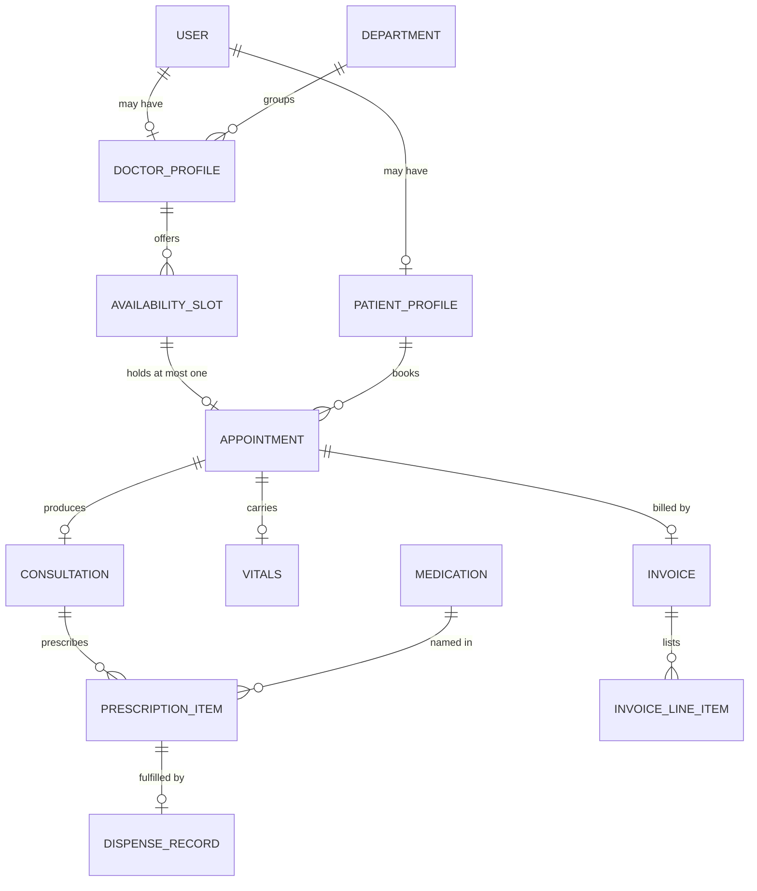
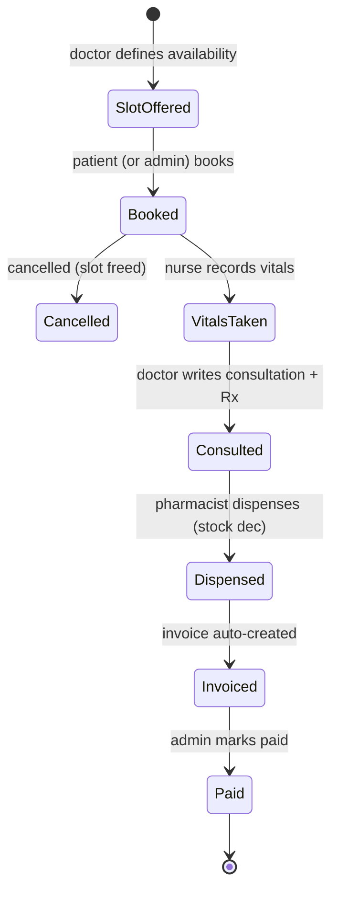

# HMS Domain Model

Entities, relationships, and invariants for v1 (ADR-0008). Terms are defined in the
[glossary](glossary.md).

## Entity map

## Entities

| Entity | Key fields | Notes |
|--------|-----------|-------|
| `User` | id, full_name, email, password_hash, role | All five roles are users. |
| `DoctorProfile` | user_id, department_id, specialty | 1:1 with a doctor User. |
| `PatientProfile` | user_id, date_of_birth, phone, address | 1:1 with a patient User. |
| `Department` | id, name | Owned by Admin. |
| `AvailabilitySlot` | id, doctor_id, starts_at, ends_at | Generated from a doctor's schedule. |
| `Appointment` | id, slot_id (unique), patient_id, doctor_id, status | Status: `booked`/`completed`/`cancelled`/`no_show`. |
| `Consultation` | id, appointment_id, diagnosis, notes | Written by the appointment's doctor. |
| `Vitals` | id, appointment_id, blood_pressure, temperature, pulse, weight | Written by a nurse. |
| `PrescriptionItem` | id, consultation_id, medication_id, dose, frequency, duration | |
| `DispenseRecord` | id, prescription_item_id, pharmacist_id, dispensed_at | One per item; decrements stock, prices the invoice line. |
| `Medication` | id, name, unit_price, stock_quantity, low_stock_threshold | Owned by Pharmacist. |
| `Invoice` | id, appointment_id, total, status | Created on `completed`; status `unpaid`/`paid`. |
| `InvoiceLineItem` | id, invoice_id, description, amount | Consultation fee + dispensed items. |

## Invariants (enforced by the backend + database)

1. **Slot exclusivity** — one appointment per slot (unique constraint).
2. **Booking race safety** — booking happens in a transaction; a lost race returns
   "slot taken," never a duplicate.
3. **Ownership** — a patient reads only their own appointments, consultations,
   invoices (per-row check, not just role check).
4. **Clinical write rules** — only the appointment's own doctor writes its
   consultation; only a nurse writes its vitals.
5. **Stock honesty** — dispensing refuses when stock is zero; decrement + dispense
   record + invoice line commit atomically.
6. **Derived billing** — invoices exist only because a visit completed and items
   were dispensed; no hand-authored invoices.
7. **Referential safety** — a department with doctors can't be deleted; a slot with
   an appointment can't be deleted.

## Visit lifecycle (the demo's happy path)

## Cross-cutting

- **Auth** — JWT with role claim; endpoint guards per role (ADR-0006).
- **Patient self-visibility** — enforced in query filters, not just route guards.
- **Audit trail** — out of scope for v1; `DispenseRecord` and invoice timestamps are
  the only historical records. Flag as v2 work.