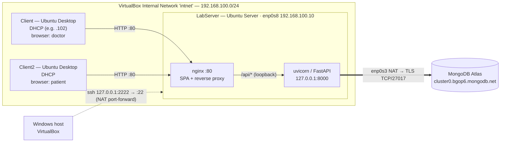

# HMS Network Topology

Graded deliverable: how the system's machines are networked. Decided in
[ADR-0016](adr/ADR-0016-lab-topology-server-plus-two-clients.md) — one server,
two role-based clients.

## Diagram

## Components

| Machine | OS | Adapters / IP | Runs | Listening |
|---------|----|---------------|------|-----------|
| `LabServer` | Ubuntu Server 24.04 | `enp0s3` NAT (DHCP) · `enp0s8` intnet **192.168.100.10/24** static | nginx, FastAPI (systemd `hms-api`) | `:80` on intnet; `:22` on NAT; `127.0.0.1:8000` |
| `Client` | Ubuntu Desktop | intnet, DHCP | Firefox | — |
| `Client2` | Ubuntu Desktop | intnet, DHCP | Firefox | — |
| MongoDB Atlas | managed cluster | public endpoints | MongoDB | `27017` (TLS, IP allow-listed) |
| Windows host | Windows 11 | — | VirtualBox, dev environment, SPA build | forwards `127.0.0.1:2222 → LabServer:22` |

## Traffic flows

1. **Client → `LabServer:80` `/`**: plain HTTP GET. nginx returns the React SPA's
   static files; client-side routes fall back to `index.html`.
2. **Client → `LabServer:80` `/api/...`**: plain HTTP REST with
   `Authorization: Bearer <JWT>`. nginx **reverse-proxies** to uvicorn on
   `127.0.0.1:8000`, adding `X-Forwarded-For` so the API logs the real client IP.
   The page and the API share one origin, so the browser does no CORS checks.
3. **`LabServer` → MongoDB Atlas**: outbound TLS on TCP/27017 via the NAT adapter,
   with SRV discovery (`mongodb+srv`). Atlas only accepts allow-listed source IPs.
4. **Host → `LabServer:22`**: ssh/scp for administration through the NAT
   port-forward. This path isn't used by clients.

## Firewall (ufw on LabServer)

| Direction | Interface | Port | Action |
|-----------|-----------|------|--------|
| in | `enp0s8` (intnet) | 80/tcp | allow |
| in | `enp0s3` (NAT) | 22/tcp | allow |
| in | any | anything else (incl. 8000) | **deny** (default) |
| out | any | any | allow |

## Talking points for the demo

- **Two role clients at once.** Patient books on `Client2`, doctor sees it on
  `Client`, and both go through the same server. Show `ip a` on each machine.
- **Reverse proxy.** One entry point (`:80`). `curl -m 3 http://192.168.100.10:8000`
  from a client times out, because the API process listens on loopback only and
  ufw drops the port.
- **Network segmentation.** `intnet` carries client traffic only; NAT is
  egress plus admin. Clients have no route to Atlas; only the server does.
- **Raw HTTP.** devtools Network tab or `curl -v` shows request/response
  headers, the JWT in `Authorization`, and status codes. `deploy/http_scenarios.py`
  walks through 200/401/403/404/405/409/422.
- **Live server log.** `journalctl -u hms-api -f` shows each client's IP per
  request.

## Known limitations (report material)

- Plain HTTP, no TLS. JWTs and passwords cross `intnet` unencrypted; this is
  acceptable for the course and is the reason HTTPS exists.
- The API needs internet egress to Atlas on demo day.
- Single server, so there's no redundancy or load balancing.
- Swagger UI (`/docs`) loads assets from a public CDN, so it only renders in a
  browser that has internet access.
- The Good tier (3 laptops on a hotspot) needs LabServer reachable outside
  VirtualBox (e.g. a Bridged adapter). That's deferred; see ADR-0016.
